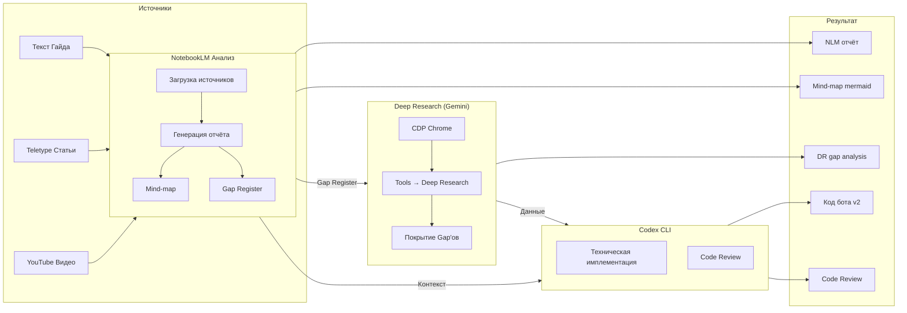

```mermaid
flowchart LR
  subgraph Sources["Источники"]
    V[YouTube Видео] --> NLM
    T[Teletype Статьи] --> NLM
    G[Текст Гайда] --> NLM
  end

  subgraph NLM["NotebookLM Анализ"]
    direction TB
    A1[Загрузка источников] --> A2[Генерация отчёта]
    A2 --> A3[Mind-map]
    A2 --> A4[Gap Register]
  end

  subgraph DR["Deep Research (Gemini)"]
    direction TB
    B1[CDP Chrome] --> B2[Tools → Deep Research]
    B2 --> B3[Покрытие Gap'ов]
  end

  subgraph Codex["Codex CLI"]
    direction TB
    C1[Техническая имплементация]
    C2[Code Review]
  end

  subgraph Output["Результат"]
    O1[NLM отчёт]
    O2[Mind-map mermaid]
    O3[DR gap analysis]
    O4[Код бота v2]
    O5[Code Review]
  end

  NLM -->|Gap Register| DR
  NLM -->|Контекст| Codex
  DR -->|Данные| Codex
  Codex --> O4
  Codex --> O5
  DR --> O3
  NLM --> O1
  NLM --> O2
```
