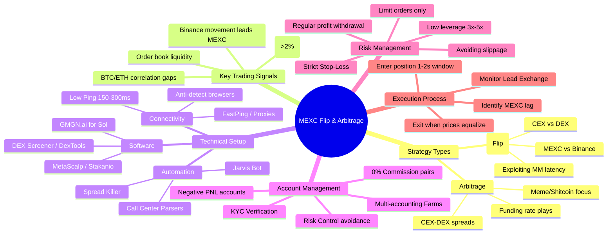

```mermaid
mindmap
  root((MEXC Flip & Arbitrage))
    Strategy Types
      Price Lag (Flip)
        MEXC vs Binance
        CEX vs DEX
        Exploiting MM latency
      Arbitrage
        CEX-DEX spreads
        Meme/Shitcoin focus
        Funding rate plays
    Key Trading Signals
      Binance movement leads MEXC
      DEX price divergence (>2%)
      BTC/ETH correlation gaps
      Order book liquidity
    Technical Setup
      Software
        MetaScalp / Stakanio
        DEX Screener / DexTools
        GMGN.ai for Sol
      Automation
        Jarvis Bot
        Call Center Parsers
        Spread Killer
      Connectivity
        Low Ping 150-300ms
        FastPing / Proxies
        Anti-detect browsers
    Account Management
      Negative PNL accounts
      Risk Control avoidance
      Multi-accounting Farms
      0% Commission pairs
      KYC Verification
    Risk Management
      Low leverage 3x-5x
      Strict Stop-Loss
      Limit orders only
      Regular profit withdrawal
      Avoiding slippage
    Execution Process
      Monitor Lead Exchange
      Identify MEXC lag
      Enter position 1-2s window
      Exit when prices equalize
```
